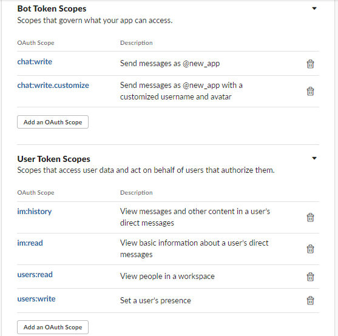
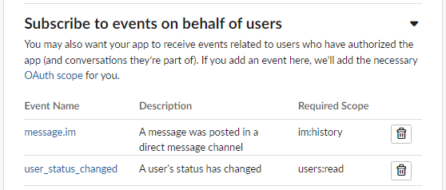
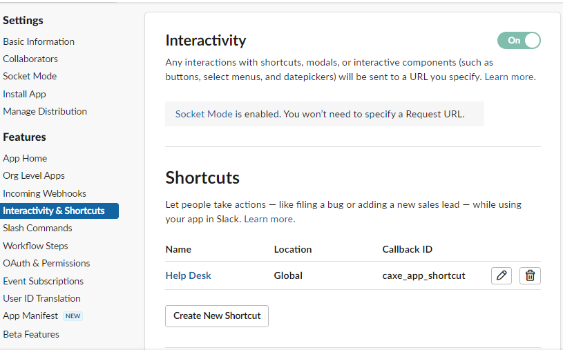
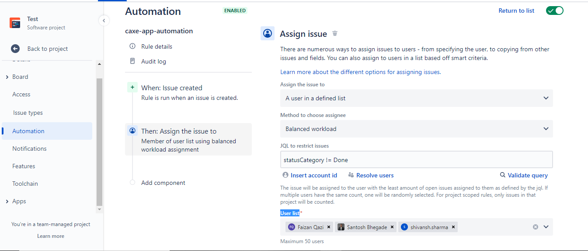
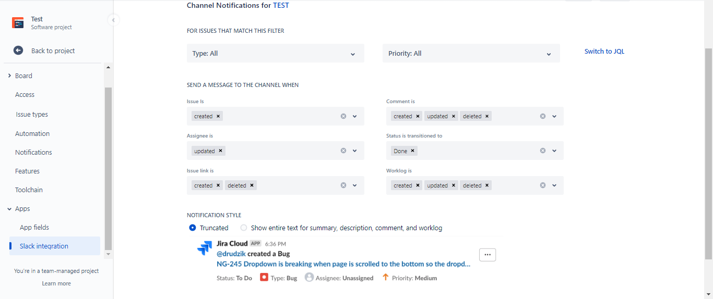

# Automated Help Desk

## Prerequisites: 
    
    - Slack Account/Workspace
    - JIRA Account 
## Description

    - This Slack App helps create Jira Tickets from within Slack App Shortcuts (app.py)
    - It also responds to messages when status set as `Out of Office`. (app_autoresp.py)

## Setup
Follow the commands to clone the project
```
git clone git@github.com:caxefaizan/slackapp.git
cd slackapp
python -m venv venv
source venv/bin/activate
python3 -m pip install --upgrade pip
python3 -m pip install -r requirements.txt
```
## Setting up the App
> We recommend using a workspace where you won’t disrupt real work getting done. You can create a new one for free [here](https://slack.com/get-started#create)
>
> Authenticate yourself and create a workspace.(Skip if you already have a workspace)
- First thing’s first: before starting with Bolt, you’ll want to create a Slack app [here](https://api.slack.com/apps/new).
- Create NewApp > From Scratch
- Fill in Details
    - App Name
    - Select the Workspace
- Create App

## Tokens and Installing apps
> For HTTP Mode we will have to add `Redirect URLs` as well`.

Slack apps use OAuth to manage access to Slack’s APIs. When an app is installed, you’ll receive a token that the app can use to call API methods.

- Navigate to the OAuth & Permissions on the left sidebar and scroll down to the Bot Token Scopes section. Click Add an OAuth Scope.
- lets add the scopes: 
    - `chat:write`: This grants your app the permission to post messages in channels it’s a member of.
    - `users:read`: Determines a user's currently set custom status by consulting their profile.
    - `users:write`: Set a user’s presence
    - `im:history`: View messages and other content in a user’s direct messages
    - `im:read`: View basic information about a user’s direct messages
> Read more about scopes and API methods [here](https://api.slack.com/methods).

<p align="center">
    
</p>

- Scroll up to the top of the OAuth & Permissions page and click Install App to Workspace. You’ll be led through Slack’s OAuth UI, where you should allow your app to be installed to your development workspace.
- Once you authorize the installation, you’ll land on the OAuth & Permissions page and see a Bot User OAuth Access Token.

<p align="center">
    
</p>

- Head over to Basic Information and scroll down under the App-Level Token section > Generate Token and Scopes (to generate an app-level token). 
    - Add token name and the `connections:write` scope to this token and save the generated xapp token.
- Navigate to Socket Mode on the left side menu and toggle to enable. ( We will change it to http later )

## Setting up events
> For HTTP mode we will have to add a `Request URL` as well.
- Navigate to Event Subscriptions on the left sidebar and toggle to enable. 
- Under Subscribe to Bot Events > Add Bot User Event > 
    - `message:im`
- Subscribe to events on behalf of users > Add Workspace Event > 
    - `message:im`
    - `user_status_changed`

<p align="center">
    
</p>

## App Settings
- App Home > Enable Messages Tab
- Interactivity & Shortcuts > Enable
- Create Shortcut with the following details 
```
Name        Location    Callback ID
Help Desk   Global      caxe_app_shortcut
```
> <span style="color:red;">**Important :**</span> The **`callback id`** reflects in the [app.py](./app.py) as well. Make necessary changes if required.

<p align="center">
    
</p>

> Remember to keep all tokens secure.

Use a `config.ini` file to store all tokens and ids.

```
# A typical config file.
[config]
KEY1 = VALUE1
KEY2 = VALUE2
```

Create the [app.py](./app.py) file.
```
# eg. app.py
import os
from slack_bolt import App
from slack_bolt.adapter.socket_mode import SocketModeHandler

# Initializes your app with your bot token and socket mode handler
app = App(token=os.environ.get("SLACK_BOT_TOKEN"))

# Start your app
if __name__ == "__main__":
    SocketModeHandler(app, os.environ["SLACK_APP_TOKEN"]).start()
```

## HelpDesk Automation
### Structure for Form Generation
1. Departments

    To include more departments, add each in `departments.txt` on a separate line and then create a corresponding file called `DEPARTMENTNAME_categories.txt`.
2. Categories

    To include new issue categories for existing or newly created department, add them in their respective `DEPARTMENTNAME_categories.txt` file on a separate line.

## Auto Out Of Office Replies
To use this feature set your status as `Out of Office`.
The App will generate a response on your behalf as:
```    
Hi, User!!!
I am Out of Office and will be back on 2022-06-08 14:42:10
```
The time is calculated based on your Status Expiration time.
But if the clear date is not provided our response would be
```
Hi, User!!!
I'll be Out of Office for a while. In case of emergency please reach out to <YOUR_CAREER_MANAGER>. Thanks
```
> The App autoreplies once every 20 unresponded messages per channel during the day.   

## We're all set!!!
Run the app `python3 app.py`

# HTTP Mode (Disable Socket Mode)
## Install ngrok
```
curl -s https://ngrok-agent.s3.amazonaws.com/ngrok.asc | \
      sudo tee /etc/apt/trusted.gpg.d/ngrok.asc >/dev/null && \
      echo "deb https://ngrok-agent.s3.amazonaws.com buster main" | \
      sudo tee /etc/apt/sources.list.d/ngrok.list && \
      sudo apt update && sudo apt install ngrok
```
## Connect your agent to your ngrok account
Now that the ngrok agent is installed, let's connect it to your ngrok [Account](https://dashboard.ngrok.com/). If you haven't already, sign up (or log in) to the ngrok Dashboard and get your Authtoken.

Copy the value and run this command to add the authtoken in your terminal.
```
ngrok config add-authtoken TOKEN
```
- Start Bolt `python app.py`
- Startk ngrok `ngrok http 3000`
- Append the forarding link with /slack/install
    - eg. `https://46db-49-36-200-218.ngrok.io/slack/install`
    - Authorize the installation and you are good to go.

## JIRA Setup
- Login to your Jira Account
- Go to your account settings > Security > API Tokens > Create and Manage Tokens > Create Api Token > Copy it and store it in your `config.ini` file. (You wont be able to see it again)
```
# config.ini
[jira]
JIRA_TOKEN = YOUR_TOKEN
JIRA_URL = https://caxefaizan.atlassian.net/rest/api/2/issue/
JIRA_USERNAME = YOUR_JIRA_USERNAME
```
Create a New Project (HR). It reflects in `app.py`

```
ticket_data = {
    "fields": {
        "project": {
            "key": "HR"
        }
```
- Project Settings > Create Rule
- Actor > Automation for Jira
    - When: Issue Created
    - Then: Assign issue
        - Assign the issue to > A user in a defined list
        - Method to choose assignee > Balanced workload
        - JQL to restrict issues > statusCategory != Done
        - User list > HR1, HR2, HR3

<p align="center">
    
</p>

- Apps > Slack Integration
<p align="center">
    
</p>